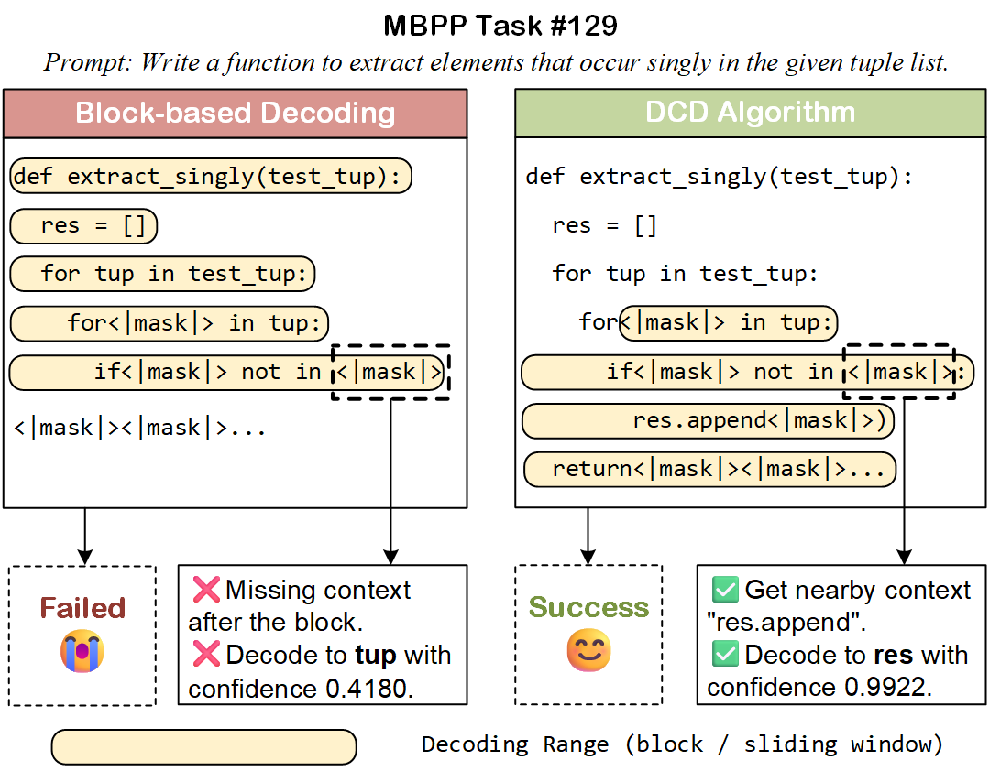

# Deferred Commitment Decoding for Diffusion Language Models 

Yingte Shu, Yuchuan Tian, Chao Xu, Yunhe Wang, Hanting Chen

This is the official codebase for our work *Deferred Commitment Decoding for Diffusion Language Models*.

## Reproduction

### Reprocude lm_eval_harness

To reproduce the LLaDA-8B-Instruct, Dream-v0-Base-7B and Fast-dLLM-v2-7B results, install neccessary libraries (generally in requirements.txt, better with Linux and python 3.10) and adapt run_all.sh to your environment. 

### Reproduce opencompass

To reproduce the NBDiff results:

1. Clone opencompass from [Github](https://github.com/open-compass/opencompass.git)

2. Generate ['gsm8k_0shot_gen_a58960', 'humaneval_gen_8e312c', 'math_500_gen_my', 'sanitized_mbpp_mdblock_0shot_nocot_gen_a2e416', 'IFEval_gen_353ae7'] five jsonl files (or what you want to evaluate) to ./opencompass/data

3. Adapt eval2.sh (i.e. change dataset_local_path to one of the jsonl files and local_save your save path) and run it based on run_nbdiff.sh

4. Move process.py to opencompass base directory and run: python process.py [your save path] [any model name, like NBDiff]

## Acknowledgement

This repository contains parts of [Fast-dLLM](https://github.com/NVlabs/Fast-dLLM) and [DAEDAL](https://github.com/Li-Jinsong/DAEDAL). We thank them for their helpful code.

