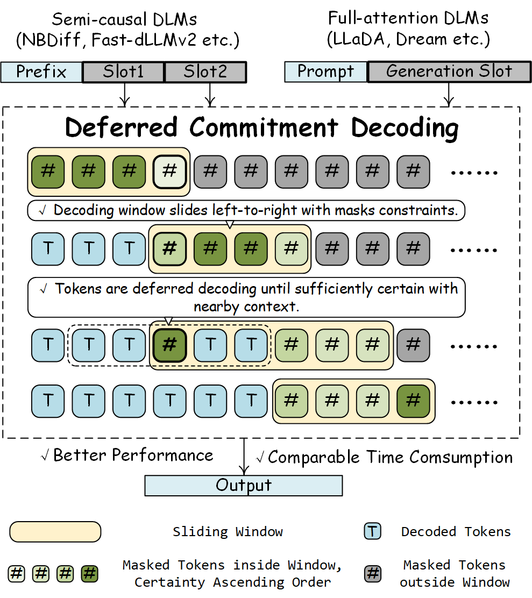

# Deferred Commitment Decoding for Diffusion Language Models 

Yingte Shu, Yuchuan Tian, Chao Xu, Yunhe Wang, Hanting Chen

This is the official codebase for our work *Deferred Commitment Decoding for Diffusion Language Models*.

## Reproduction

To reproduce the LLaDA-8B-Instruct, Dream-v0-Base-7B and Fast-dLLM-v2-7B results, install neccessary libraries and adapt run_all.sh to your environment. To reproduce the NBDiff results, download benchmark json files (or create by yourself based on appendix), adapt eval2.py and evaluate result files seperately in opencompass.

## Acknowledgement

This repository contains parts of [Fast-dLLM](https://github.com/NVlabs/Fast-dLLM) and [DAEDAL](https://github.com/Li-Jinsong/DAEDAL). We thank them for their helpful code.

